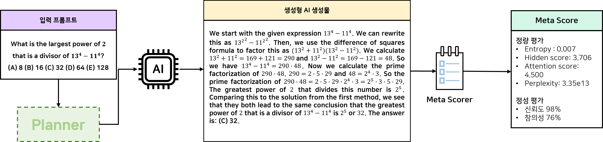

# AGI 발현을 위한 메타인지 프레임워크 핵심기술 개발 및 실증
## AGI 발현을 위한 Verifier에 대한 연구 개발
### 정량적 방식과 정성적 방식을 모두 고려하는 범용적 활용 가능한 Meta Scorer
### 💡 예시


## ⚙️ Requirements
To install requirements:
```
pip install -r requirements.txt
```

### ✨ LLM Evaluator 사용을 위해 API Key를 ```API_KEYS.json```에 입력해주세요.
API_KEYS.json 예시
```
{
    "GEMINI_API_KEY": "YOUR_GEMINI_API_KEY",
    "OPENAI_API_KEY": "YOUR_OPENAI_API_KEY"
}
```

## 💻 Usage Guide
### 1. 입력 프롬프트에 대한 모델 답변 생성
```
python src/generation.py --model_name "generation_model_name" --dataset_name "CreativeMath" --do_sample True --temperature 0.7 --top_p 1.0 --top_k 0.7 --max_new_tokens 1024
```

### 2. Meta-Scorer를 통한 다양한 meta-score 계산
생성된 답변에 대해 Meta-Scorer가 정량적·정성적 평가를 모두 수행하여 여러 종류의 meta-score를 산출합니다.
```
python src/meta_scorer.py --model_name "generation_model_name" --dataset_name "CreativeMath"
```
**정량 평가 (Quantitative Evaluation)**
- 모델의 내부 상태(internal states)를 활용한 meta-score 계산
    - entropy(logit, window), hidden score, attention score, perplexity 등

**정성 평가 (Qualitative Evaluation)**
- 외부 LLM Evaluator를 활용한 평가
    - 신뢰도(reliability), 창의성(creativity) 등

## 🧠 작동 원리
**1️⃣ 토큰 생성 및 모델 출력 획득** \
모델은 ```generate()``` 함수를 통해 입력 프롬프트에 대한 답변을 생성합니다.

**2️⃣ Meta-Scorer: 정량 평가 수행** \
생성된 답변에 대해 먼저 정량 평가를 수행합니다. \
모델의 입력 프롬프트와 생성 결과를 concat하여 다시 모델에 입력하고, \
내부 확률 분포, hidden state, attention 값을 기반으로 entropy, perplexity, hidden score, attention score 등의 지표를 계산합니다. 

**3️⃣ Meta-Scorer: 정성 평가 수행** \
정량 평가 후, 외부 LLM Evaluator를 활용해 정성 평가를 수행합니다. \
Evaluator는 생성된 답변의 신뢰도(reliability), 창의성(creativity) 등 다양한 측면에서의 품질을 평가합니다.

**💡 장점**
- 단일 metric에 의존하지 않고, 정량적 + 정성적 평가를 결합하여 다면적 분석이 가능합니다.
- 모델 내부 상태뿐 아니라 외부 모델 기반 평가를 통해 다양한 관점에서 결과를 검증할 수 있습니다.
- 특히 창의성(creative reasoning)과 같은 확장된 평가 기준을 도입하여 기존의 평가 체계를 한층 확장시킵니다.

### References
[LLM-Check: Investigating Detection of Hallucinations in Large Language Models](https://proceedings.neurips.cc/paper_files/paper/2024/file/3c1e1fdf305195cd620c118aaa9717ad-Paper-Conference.pdf)
```
@inproceedings{NEURIPS2024_3c1e1fdf,
 author = {Sriramanan, Gaurang and Bharti, Siddhant and Sadasivan, Vinu Sankar and Saha, Shoumik and Kattakinda, Priyatham and Feizi, Soheil},
 booktitle = {Advances in Neural Information Processing Systems},
 editor = {A. Globerson and L. Mackey and D. Belgrave and A. Fan and U. Paquet and J. Tomczak and C. Zhang},
 pages = {34188--34216},
 publisher = {Curran Associates, Inc.},
 title = {LLM-Check: Investigating Detection of Hallucinations in Large Language Models},
 url = {https://proceedings.neurips.cc/paper_files/paper/2024/file/3c1e1fdf305195cd620c118aaa9717ad-Paper-Conference.pdf},
 volume = {37},
 year = {2024}
}
```

[Assessing the Creativity of LLMs in Proposing Novel Solutions to Mathematical Problems](https://arxiv.org/pdf/2410.18336)
```
@article{ye2024assessing,
  title={Assessing the Creativity of LLMs in Proposing Novel Solutions to Mathematical Problems},
  author={Ye, Junyi and Gu, Jingyi and Zhao, Xinyun and Yin, Wenpeng and Wang, Guiling},
  journal={arXiv preprint arXiv:2410.18336},
  year={2024}
}
```
